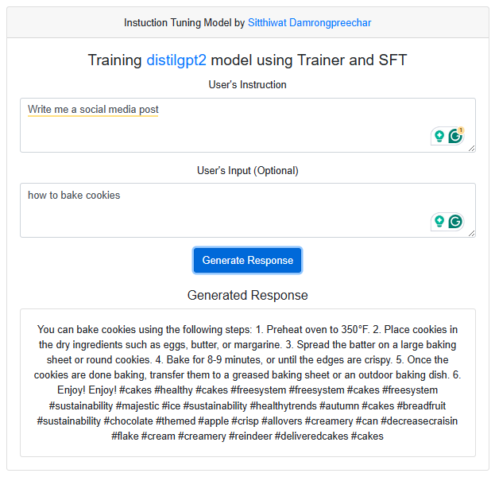

# Instruction_Tuning_with_hf&AlpacaEval

## Instruction Tuning 'distilgpt2' model using Trainer and SFT
We're going to develop an instruction model using the Large Language Model (LLM) from Hugging Face. To enhance our training process, we'll utilize Alpaca Format for instruction tuning and evaluation with Alpaca Eval. To delve deeper into this, refer to the `AlpacaInstructionTuning.ipynb` files.


## Web application with Flask
This web application is constructed using Flask, a widely-used Python web framework. This web application will allow users to input instructions and inputs, and the model will generate responses based on the provided input. We integrated the instruction model into the Flask application, providing a seamless user experience.

### Quick Start with Docker Compose

1. **Clone the repository:**
    ```bash
    git clone https://github.com/SitthiwatDam/A8_Instruction_Tuning_with_hf-AlpacaEval.git
    ```

2. **Navigate to the project directory:**
    ```bash
    cd A8_Instruction_Tuning_with_hf-AlpacaEval
    ```

3. **Build and run the Docker containers:**
    ```bash
    docker-compose up -d
    ```

4. **Access the application:**
    - Open your web browser and go to [http://127.0.0.1:5000/](http://127.0.0.1:5000/)

5. **Chatting with AIT-GPT:**
    - Enter your instruction and prompt in the text areas.
    - Click "Generate Response" button to submit the user instruction and prompt.


6. **Stop the application when done:**
    ```bash
    docker-compose down
    ```

### Web Application Interface



